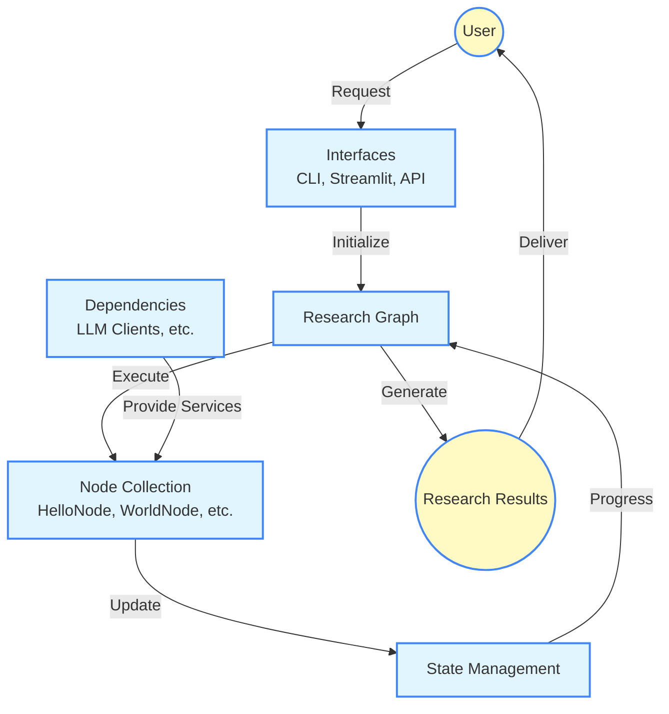

# Research Agent Architecture

This document provides an overview of the Research Agent system architecture, explaining how the different components work together.

## System Overview

The Research Agent is built on a workflow system that processes information through a series of specialized components called "nodes." Each node performs a specific task, and together they form a complete research pipeline.



## Key Components

### Core Components

1. **Nodes**
   - Self-contained units of processing logic
   - Each node has a specific responsibility (e.g., generating text, combining information)
   - Nodes are connected to form a directed graph that information flows through

2. **State**
   - Holds all the data being processed
   - Passed from node to node as the workflow progresses
   - Maintains the history of operations and results

3. **Graph**
   - Defines the structure of the workflow
   - Determines which nodes run and in what order
   - Manages the execution flow

4. **Dependencies**
   - External services or resources needed by nodes
   - Includes LLM (Large Language Model) clients
   - Uses dependency injection for flexibility and testability

### Interface Layers

1. **Command-Line Interface (CLI)**
   - Text-based interface for running the agent
   - Supports various configuration options
   - Ideal for scripting and automation

2. **Web Interface (Streamlit)**
   - Visual interface for interacting with the agent
   - Provides real-time feedback and visualizations
   - More user-friendly for non-technical users

3. **API Layer**
   - Service functions that other interfaces can use
   - Abstracts the core functionality for reuse

## Information Flow

1. The process begins with a user request through one of the interfaces
2. The request is translated into a workflow with an initial state
3. The graph engine executes the nodes in sequence:
   - **HelloNode** generates the initial text
   - **WorldNode** generates additional text
   - **CombineNode** merges the generated texts
   - **PrintNode** outputs the final result
4. Each node updates the state and passes it to the next node
5. When the workflow completes, the result is returned to the user

## Extension Points

The architecture is designed to be extensible in several ways:

1. **Custom Nodes**
   - New nodes can be created to handle different research tasks
   - Nodes can be reused across different workflows

2. **Custom Dependencies**
   - Different LLM providers can be plugged in
   - Additional services can be added as dependencies

3. **Alternative Interfaces**
   - New interfaces can be built on top of the API layer
   - Different visualization approaches can be implemented

## Design Principles

The Research Agent architecture follows these key principles:

1. **Separation of Concerns**
   - Each component has a clear, specific responsibility
   - Components are loosely coupled through well-defined interfaces

2. **Testability**
   - Components can be tested in isolation
   - Dependencies can be easily mocked for testing

3. **Extensibility**
   - New components can be added without modifying existing ones
   - The system can evolve to support new use cases

4. **User-Centered Design**
   - Multiple interfaces support different user preferences
   - Configuration options allow customization

## Technologies Used

- **Python**: Core programming language
- **Pydantic-Graph**: Framework for defining and executing node-based workflows
- **Streamlit**: Framework for building interactive web interfaces
- **Pytest**: Testing framework
- **Various Code Quality Tools**: Black, isort, flake8, pylint, mypy, bandit

## Future Architecture Evolution

As the Research Agent evolves, we anticipate these architectural changes:

1. Integration with real LLM services through API clients
2. More sophisticated node types for advanced research tasks
3. Persistent storage for research results and session history
4. A graph visualization component to help users understand workflows
5. A workflow builder interface for creating custom research pipelines 

## API Endpoints

The Research Agent provides a set of API endpoints that can be used to integrate with external systems or build custom interfaces:

### Core API Endpoints

1. **Research Graph Execution**
   - `POST /api/research/execute`
   - Executes a research workflow with the provided parameters
   - Accepts configuration for LLM settings and initial state
   - Returns the complete result set with timing information

2. **Node Management**
   - `GET /api/nodes` - List all available nodes
   - `GET /api/nodes/{node_id}` - Get details about a specific node
   - `POST /api/graphs` - Create a custom workflow from specified nodes

3. **Results and History**
   - `GET /api/research/{session_id}` - Retrieve results from a previous session
   - `GET /api/research/history` - List recent research sessions

### API Usage

These endpoints can be accessed through standard HTTP requests using the appropriate authentication. Example usage with Python:

```python
import requests

# Execute a research workflow
response = requests.post(
    "https://api.researchagent.example/api/research/execute",
    json={
        "query": "Advancements in quantum computing",
        "depth": "comprehensive",
        "llm_settings": {
            "model": "advanced-research-model",
            "temperature": 0.3
        }
    },
    headers={"Authorization": "Bearer YOUR_API_TOKEN"}
)

results = response.json()
```

For full API documentation, refer to the OpenAPI specification in the `api` directory. 